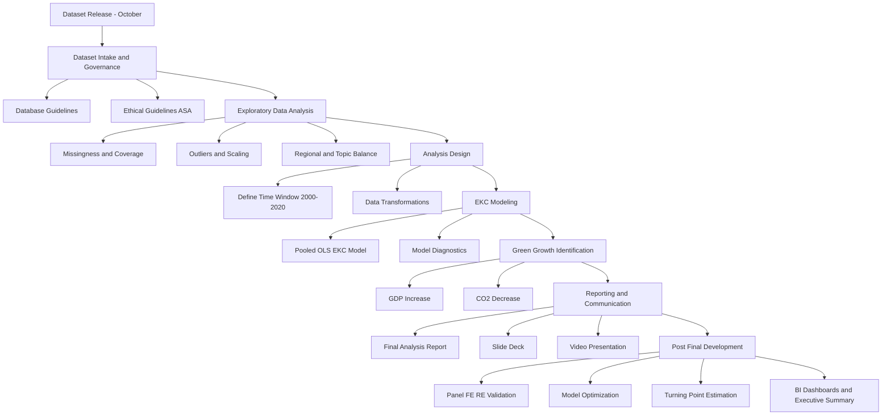

# WDI–EKC Sustainability Assessment Framework  
**ASA International Data Quest (Türkiye) — Smyrna DataLab Team Submission**

This repository contains our end-to-end sustainability assessment workflow based on the **Environmental Kuznets Curve (EKC)** using the **World Development Indicators (WDI)** dataset. The work was prepared as part of the **ASA International Data Quest**, an annual data event sponsored by the **American Statistical Association (ASA) Committee on International Relations in Statistics**, starting in **Fall 2025**.

Our deliverables emphasize:
- **Statistical insight** (EKC modeling and interpretation),
- **Ethical practice** aligned with the **ASA Ethical Guidelines for Statistical Practice**,
- **Clear communication** through a 5-minute video and a concise slide deck.

## Project Execution and Technical Scope

The technical execution of this project was carried out end-to-end within a highly constrained timeframe.  
All core analytical and engineering components were **individually designed and implemented by the project lead within approximately 10 hours**, culminating in a complete and submission-ready competition package.

Within the scope of the project:

- A comprehensive exploratory phase was completed, including **six focused EDA reports** and a **general EDA report**, addressing data quality, missingness, outliers, and structural imbalances.
- An **environmental sustainability–oriented database structure** was designed to support EKC-based analysis and downstream reporting.
- Using **Python**, the workflow covered data cleaning, transformations, EKC modeling, analytical evaluation, and **hyperparameter optimization**.
- To enable rapid transition to reporting and visualization tools, **report-ready CSV outputs** were generated for direct use in **Power BI and Tableau** (visual dashboards were not produced at this stage).

## Team and Acknowledgements

Other team members contributing to the conceptual and theoretical aspects of the project include **Ali Kınış** and **Ahmet Aslan**.

We also gratefully acknowledge **Prof. Dr. Ceylan Yozgatligil** for providing clear and guiding instructions during the application and submission process of the ASA International Data Quest.

---

## Competition Context (ASA International Data Quest)

**Format and timeline**
- The dataset is released on the **first Monday of October**.
- Teams work throughout **October**.
- Submissions are due on the **last Friday of October** and must include:
  - A **5-minute video presentation**
  - **Slides** (max **4 content slides**, excluding cover and references)

**Award categories (undergraduate and master’s levels, evaluated separately)**
- Best Data Visualization  
- Best Consideration of Ethics  
- Best Statistical Insight  

**Eligibility**
- Teams of **2–4** students (either **undergraduate** *or* **master’s**; no mixing categories)
- Students from **any discipline** may participate

---

## Repository Contents

- **WDI - EKC Sustainability Assessment Framework.ipynb**  
  Main notebook: data preparation, transformations, EKC modeling, and interpretation.

- **Database.ipynb**  
  Dataset handling utilities and structured extraction steps.

- **Final Analysis Report.pdf**  
  Consolidated results for 2000–2020 (including EKC shape interpretation and green growth candidates).

- **General EDA Report.pdf**  
  Dataset-wide exploratory diagnostics and high-level distributional findings.

- **DataLab Ethical Guidelines.pdf**  
  Applied ethics checklist aligned with ASA principles (transparency, assumptions, limitations, privacy).

- **Database Guidelines.pdf**  
  Dataset standards and handling guidance used in this work.

- **Development Guidelines After Final Analysis.pdf**  
  Post-final roadmap: FE/RE panel validation, optimization, turning-point computation, and reporting.

- **Exploratory Data Analysis.zip**  
  Supporting EDA artifacts (plots, summaries, intermediate outputs).

- **WDI_EKC_outputs.zip**  
  Exported outputs for reporting and visualization tooling (tables, candidates lists, figures).

- **Work Presentation.pptx**  
  Slide deck prepared for submission (concise, competition-compliant).

- **ASA DATA QUEST Smyrna DataLab Team Presentation by Meriç Özcan.mp4**  
  5-minute video presentation aligned with the slide deck.

---

## Project Workflow (Mermaid)

## How to Use

1. Open **WDI - EKC Sustainability Assessment Framework.ipynb** to reproduce the full sustainability and EKC analysis workflow, including data filtering, transformations, modeling, and interpretation.

2. Use **Database.ipynb** to review how the WDI dataset is loaded, structured, and prepared for analysis. This notebook documents dataset handling and preprocessing decisions.

3. Read **General EDA Report.pdf** to understand the exploratory data analysis results, including missing data patterns, outlier behavior, regional imbalances, and key data quality constraints.

4. Review **Final Analysis Report.pdf** for the consolidated findings covering the 2000–2020 period, including EKC modeling results, identification of green growth candidates, and regional dynamics.

5. For competition-ready outputs, refer to:
   - **Work Presentation.pptx** for the concise slide deck prepared under ASA International Data Quest rules.
   - **ASA DATA QUEST Smyrna DataLab Team Presentation by Meriç Özcan.mp4** for the 5-minute video presentation aligned with the slides.

---

## Ethics and Transparency

This project is explicitly aligned with the **ASA Ethical Guidelines for Statistical Practice**. Ethical considerations are embedded throughout the workflow, with emphasis on:

- Clear documentation of data sources, preprocessing steps, and time-window restrictions  
- Transparency regarding model assumptions, transformations, and limitations  
- Explicit separation of exploratory and confirmatory analyses  
- Responsible communication of uncertainty and limits to generalizability  

Detailed ethical procedures and checklists are documented in **DataLab Ethical Guidelines.pdf**.

---

## Credits

**Smyrna DataLab Team**  
Repository and presentation prepared by **Meriç Özcan**.

---

## License

This repository is intended for educational and research purposes.  
If you reuse or adapt any part of this work, please provide appropriate attribution to the repository and comply with the original dataset’s terms of use.
